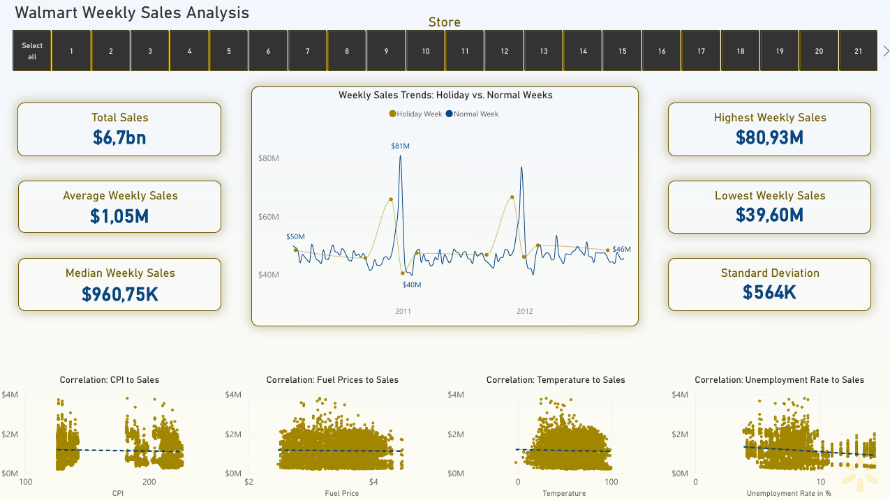
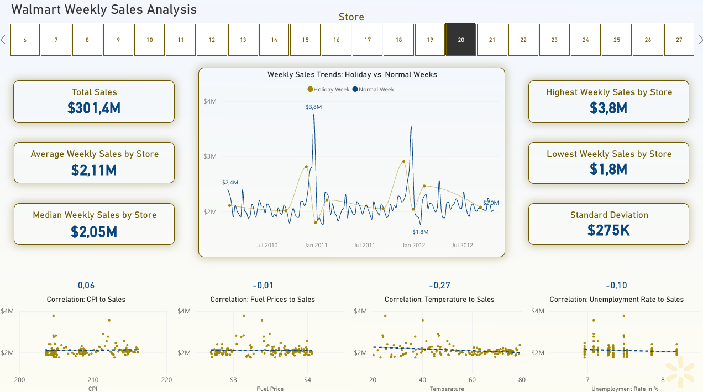
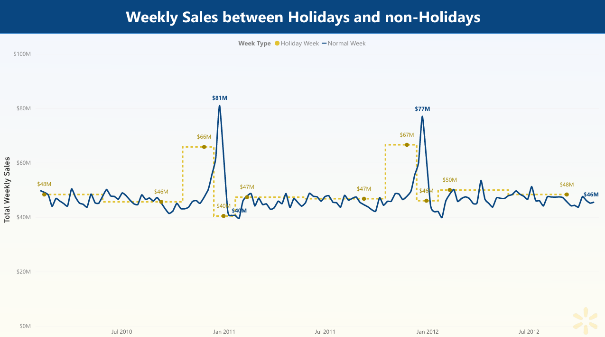

# **Walmart Sales Case Study**

## **Executive Summary**:

**Objective**:  
This Case Study analyzes how various factors influence the weekly sales performance of **45 Walmart stores**.

**Data Overview**:  
The analysis uses Kaggle’s Walmart weekly sales data from **2010–2012**, including store-level sales, holidays, CPI, fuel prices, unemployment rate, and temperature.

**Key Insights**:  
1.	**Seasonality Peak**: Data shows that the Q4 holiday window (**Nov 25 – Dec 25**) is the critical driver of annual revenue, generating a **41%** sales lift in 2010 and a **31.7%** lift in 2011 compared to the yearly averages.
2.	**External Factors Resilience**: This analysis also shows that correlations between sales and external factors like CPI, Fuel Prices, and Temperature are consistently near zero. The most notable relationship is with the Unemployment Rate **(-0.11)**, which is still a very weak negative correlation. This suggest that Walmart’s “**Everyday Low Price**” strategy is relatively resilient to extern economic and environmental factors. 

**Recommendations**:  
1.	Increase inventory and staffing ahead of the Q4 holiday period
2.	Prioritize promotional campaigns during peak seasonal windows

### **Business Task**:  

##### *Analyze how various factors influence the weekly sales performance of 45 Walmart stores*

This interactive Power BI dashboard visualizes sales performance across **45 stores**, highlighting a **$6.7bn** total revenue with significant seasonal peaks during holiday weeks.  
By analyzing correlations between sales and external factors like CPI, fuel prices, and temperature, the report identifies that these macroeconomic shifts have **low impact** on Walmart's core revenue.  

  

### **Methodology**:
1. Extracted & organized the dataset, reviewed dataset structure and variables
2. Evaluated dataset reliability using the ROCCC framework (Relevant, Objective, Complete, Consistent, Current)
3. Checked for null values and duplicate rows, validated data accuracy and consistency in SQL
4. Calculated correlations & variance, and extracted the required data for dashboards using SQL queries
5. Built basic and interactive dashboards in Power BI

### **Skills**:
    SQL: Data validation, trend analysis, CTEs & data transformation
    Power BI: Data  transformation, interactive dashboard creation and data visualization
    PowerPoint: Designing easy-to-understand presentations with highlighted key insights
    Jupyter Notebook: Markdown documentation

**Quick SQL Code**:
```
-- TASK 13: Calculate correlation between Weekly Sales vs Temperature, Fuel_Price, CPI and Unemployment and create the View
----------------------------------------------------------------
CREATE OR REPLACE VIEW `walmartproject-03.Walmart_Dataset.Sales_vs_MacroeconomicFactors_Correlation`
AS
  SELECT
    ROUND(CORR(Weekly_Sales, Temperature), 2) AS temperature_to_sales_corr,
    ROUND(CORR(Weekly_Sales, Fuel_Price), 2) AS fuel_price_to_sales_corr,
    ROUND(CORR(Weekly_Sales, CPI), 2) AS CPI_to_sales_corr,
    ROUND(CORR(Weekly_Sales, Unemployment), 2) AS unemployment_to_sales_corr
  FROM 
    `walmartproject-03.Walmart_Dataset.Walmart_Sales`;
----------------------------------------------------------------
```

### **Results & Business Recommendation**:
The analysis shows that the Q4 holiday window (**Nov 25 – Dec 25**) is the primary driver of annual sales performance. During this period, sales significantly increase compared to the yearly averages, highlighting the importance of seasonal demand.  
The analysis also shows that external economic and environmental factors such as Temperature, Fuel Prices, and CPI have **very weak correlations** with sales, indicating little to no measurable impact. The strongest observed relationship is with the Unemployment Rate, but the correlation remains **very weak**.  
These findings suggest that Walmart’s “**Everyday Low Price**” strategy helps maintain stable demand regardless of external economic fluctuations.  

1. Dashboard overview of the best performing store (**Store 20**)  



---

2. Sales trendline highlighting holiday seasonality impact (**Nov 25 – Dec 25**)



---

3. Trendline comparison between overall **System Average** and **Individual Store Averages**


---

4. Store volatility comparison incl. **most and least** volatile stores  


**Key Insights**:  
•	Sales increase sharply during the **Nov 25 – Dec 25** period    
•	Holiday season contributes the largest portion of **annual revenue**, making seasonal planning critical     
•	CPI, Fuel Prices, Temperature and Unemployment Rate show **very weak correlation** with weekly sales   

**Recommendations**:  
•	Increase inventory and staffing ahead of the Q4 holiday window      
•	Launch targeted marketing campaigns and promotions during peak holiday weeks    
•	Analyze top-performing stores (like **Store 20**) to replicate successful strategies across other locations     
•	Identify low-performing or volatile stores for improvement opportunities        
•	Use seasonal trends to inform marketing spend allocation, promotion timing, and inventory distribution      
•	Monitor and update forecasts yearly to account for changing seasonal patterns   

### **Next Steps**:
•	Include more recent sales data to ensure insights reflect current trends    
•	Add store-level information such as location, size and demographics for deeper regional analysis    
•	Include variables such as promotions, competitor activity or local events   
•	Use insights to guide inventory planning, staffing and marketing campaigns, particularly during peak holiday periods    
•	Set up dashboards to track sales, seasonal trends and external factors in real-time     
